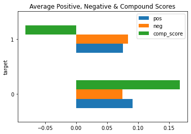
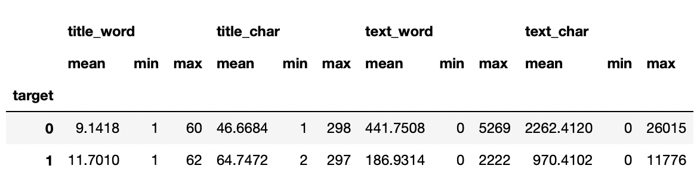
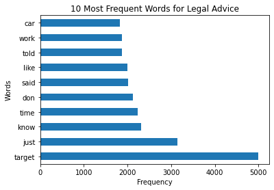
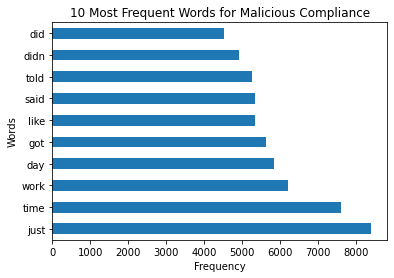
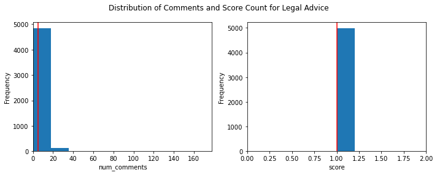
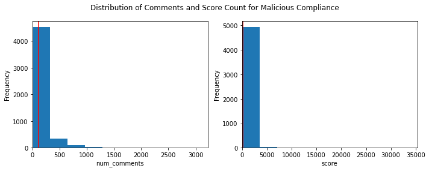
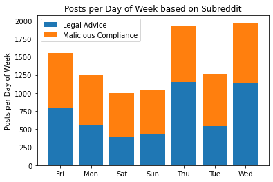
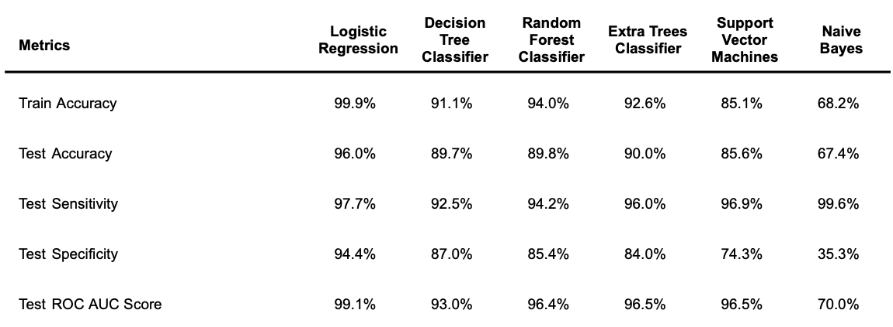

#  Project 3: Web APIs & NLP

## I. Problem Statement 

A legal firm is looking to create a contact form for their pro-bono legal clinic’s website. I have been hired to create a machine learning classification model for this new feature that would help filter out non-legal inquiries.

## II. Executive Summary

### Data Collection

Using [Pushshift's API](https://api.pushshift.io/), a function that takes in the subreddit name, type of data we want to scrape (post submissions or comments) and whether we want to filter out non-self created posts (True by default), and returns a csv file consisting of 5,000 unique subreddit documents - in this case posts, was created. 

To be able to answer the problem statement, we scrapped data from the following subreddits:
1. [r/LegalAdvice](https://www.reddit.com/r/legaladvice/): *A place to ask simple legal questions, and to have legal concepts explained.* This is the target class. 
2. [r/MaliciousCompliance](https://www.reddit.com/r/MaliciousCompliance/): Posts about *people conforming to the letter, but not the spirit, of a request.*

*Note: The subreddits are chosen based on its ability to answer the problem statement. LegalAdvice as target class is determined due to the nature of the posts as described above, which may be similar to the kind of document the client can expect to receive from their target users. MaliciousCompliance was chosen due to the text-based nature of the subreddit which the model can learn from in order to differentiate legal-related matters vs non-legal related matters which would be beneficial in answering the problem statement.*

### Data Cleaning and Pre-Processing

The following actions were executed during data cleaning and pre-processing:
- Removal of null values by replacement
- Replacement or removal of unusual text and characters (i.e. emojis, etc.)
- Feature engineering of word and character count for title and selftext 

### Exploratory Data Analysis

##### Sentiment Analysis

Looking at the above graph, particularly the mean compound score, we can see that on average, r/LegalAdvice posts tend to have a relatively negative sentiment, whilst r/MaliciousCompliance posts have a more positive sentiment, with average compound scores of -0.08 and +0.17, respectively. 

##### Word and Character Count  

When comparing the word and character counts for the title and selftext we can spot an inverse relationship between title and selftext counts per subreddit. Looking at both the range (min and max values) and mean scores, we can see that r/LegalAdvice posts tend to have longer titles and shorter body text whilst r/MaliciousCompliance posts tend to have shorter titles but longer body text.

##### Word Frequency

  

At a glance, the most frequent words in both subreddits do not seem to have any specific significance (even after filtering out english stop_words), aside from "target" - the most frequent word within the r/LegalAdvice corpus. There is some overlap between the two subreddits, with common frequent words like “like”, “work", “just”, “said”, “told”.

##### Number of Comments and Score Distribution

 

 

On average, r/MaliciousCompliance posts have more comments and better scores, with a mean of 112.7 and 193.4, respectively, and a range of 0-3.2k and 0-35.3k, respectively. Whilst r/LegalAdvice have an average comment count and score of 4.9 and 1, respectively, with range of 0-178 and 0-2, respectively. 

##### Posts per Day of Week

 

As we can see above, r/LegalAdvice have more posts on Wednesday, Thursday and Friday (average posts of 1030 vs 477.5 on other days), whilst r/MaliciousCompliance seem to have a relatively stable daily post count (ranging around 606-830 posts per day).

### Modeling and Evaluation

Based on the EDA above, we know that sentiment scores, word and character counts for both title and text, number of comments, score and day posted column would be valuable features for the model. However, we also learned from the results of *CountVectorizer()* that frequency does not always equal to value. Therefore, for the model we are using TFIDF Vectorizer, which not only counts the words within the document, but penalizes it based on how often they appear in the corpus which may reduce error from bias as a result of frequent (non-valuable) words. 

Aside from using english stopwords, we have added the subreddit names as additional stop_words to ensure that the model is not reliant on words that we know are specific to each subreddits to perform well. 

Baseline Accuracy: 50%

 

Overall we can observe a slight overfit for all models except for SVM, ranging from around a 1% to 4% difference between Train and Test. All models performed better than the baseline model of 50%, but out of all 6 models Logistic Regression has the best overall performance.

##### Definitions:
*(1) Train / Test: Train data is the data that the model learns from, whilst test data is the data the model is tested on based on its learnings.* 

*(2) Accuracy: Number of correct predictions Total number of predictions. [(source)](https://developers.google.com/machine-learning/crash-course/classification/accuracy)*

*(3) Sensitivity: Proportion of actual positives / target class was identified correctly. [(source)](https://developers.google.com/machine-learning/crash-course/classification/precision-and-recall)*

*(4) Specificity: Proportion of actual negatives / non-target class was identified correctly.* 

*(5) ROC-AUC Score: How much the model is capable of distinguishing between classes. [(source)](https://towardsdatascience.com/understanding-auc-roc-curve-68b2303cc9c5)*

## III. Conclusion and Recommendation

From the above results we can conclude that the best model for the client to use is Logistic Regression because it is able to accurately determine class with 96% accuracy and an ROC-AUC score of 99%. Although it is not as good in classifying true positives when compared to Naive Bayes (97.7% vs 99.6%) it is still relatively high and has the highest specificity score of 94%. A balance of the two is important in this case because we would not want to get many false positives (important messages not filtered out because it is categorized as legal-related when it is not) or false negatives (important messages filtered out because it is categorized as non-legal-related when it is). 

However I do recommend potentially trying different models (i.e. ensemble models like XGBoost) and/or removing features (limiting TFIDF Vectorized max features, lemmatizing or stemming words) to avoid overfitting. It is also possible to remove features that are reddit specific like number of comments and scores which would not necessarily add value for the client's purpose. 